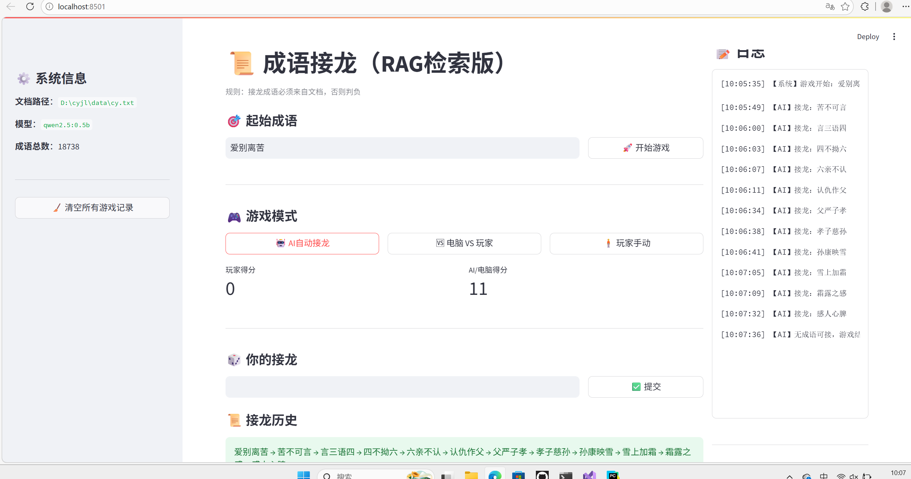

# 成语接龙
成语接龙 RAG 游戏项目说明  
基于 RAG 检索增强生成 与本地大模型实现的成语接龙小游戏，严格从本地成语库检索接龙，支持多种游戏模式、实时计分与操作日志。  
项目介绍  
基于本地成语文档 cy.txt（9876 条去重成语）构建 RAG 检索系统  
使用 Ollama + Qwen2.5 本地大模型进行成语接龙推理  
采用 Streamlit 搭建简洁 Web 交互界面  
支持玩家手动、AI 自动、电脑 VS 玩家三种模式  
实时计分 + 可滑动历史日志 + 系统信息展示  
核心功能  
🎯 严格成语校验：仅使用文档内成语，不在库则判负
🎮 三种游戏模式：手动接龙 / AI 自动接龙 / 人机对战
📊 实时计分系统：玩家与 AI / 电脑分别统计得分
📝 右侧可滑动日志：按时间正序记录接龙行为
⚙️ 左侧系统栏：展示模型信息、成语总数、文档路径
🧩 界面紧凑：宽屏布局，操作简洁流畅

前端：Streamlit  
大模型：Ollama + Qwen2.5:0.5b  
检索：LangChain + FAISS  
嵌入：HuggingFace Embeddings  
界面如下
